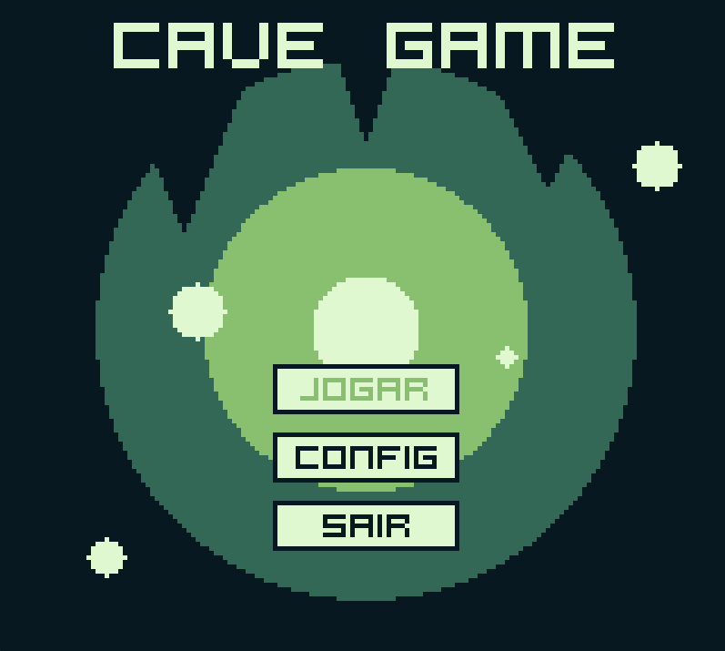

# CAVE GAME

Jogo arcade 2D desenvolvido como trabalho da disciplina de Computação Gráfica.
Todos os elementos visuais são renderizados com algoritmos gráficos implementados do zero — sem uso de funções de desenho de bibliotecas externas.

## Descrição

Cave Game é um jogo arcade 2D de exploração de masmorras. O jogador acorda em uma caverna escura sem saber como chegou ali, e precisa encontrar a saída enquanto coleta minérios, abre baús e desvia de armadilhas.

O diferencial técnico do projeto é que toda a renderização é feita manualmente, pixel a pixel, utilizando algoritmos clássicos de Computação Gráfica: rasterização de primitivas geométricas, preenchimento de regiões, transformações geométricas 2D e mapeamento de texturas por matriz.

A resolução interna do jogo é de 160×144 pixels (inspirada no Game Boy), escalada 5× para a janela final de 800×720.

---

## Como Jogar

### Objetivo

Explore a caverna, colete minérios quebrando rochas e encontre a porta de saída para vencer. Cuidado com as armadilhas escondidas no chão e com os Mimics — baús que fingem ser normais e atacam quando abertos!

### Controles

| Ação         | Teclado                 |
|--------------|-------------------------|
| Frente       | `W` ou `↑`              |
| Direita      | `D` ou `→`              |
| Trás         | `S` ou `↓`              |
| Esquerda     | `A` ou `←`              |
| Interagir    | `Space` ou `Enter`      |

### HUD

- ♥ N — Vidas restantes (3 no total)
- $ N — Minérios coletados

### Elementos do Mapa

| Elemento      | Descrição                                          |
|---------------|----------------------------------------------------|
| 🪨 Rocha     | Bloqueio sólido. Não pode ser atravessado.          |
| ⛏️ Minério   | Quebre com Espaço. Solta cristais ao destruir.      |
| 📦 Baú       | Abra com Espaço. Contém minérios.                   |
| 👾 Mimic     | Parece um baú, mas ataca! Causa dano ao ser aberto. |
| ⚠️ Armadilha | Tile invisível no chão. Causa morte instantânea.    |
| 🚪 Porta     | Encontre-a para vencer o nível.                     |

---

## Características do Jogo

### Mapa:
* Renderização baseada em matrizes, unindo diversos sprites de ambiente para formar o cenário.

### Física do Jogo:
* Sistema de colisões com tiles sólidas e triggers de posição para gerenciar as interações do jogador.

### Mineração:
* O jogador pode quebrar blocos de minérios brutos pelo mapa, liberando recursos coletáveis ao passar por cima.

### Baú:
* Objetos interativos espalhados pela caverna que concedem de 1 a 5 minérios ao serem abertos.

### Mimic:
* Monstro disfarçado de baú que surpreende o jogador ao tentar interagir, causando 1 ponto de dano.

### Animação Abertura:
* Transição que simula a queda do jogador para dentro da escuridão da caverna..

### Animação de Morte:
* O personagem dá um salto e cai para fora da tela enquanto um círculo de luz se fecha, simulando a lamparina apagando.

### Animação de Vitória:
* Uma luz se expande rapidamente a partir do centro, revelando os créditos e o menu final em um fundo claro.

### Jogo separado em Cenas:
* Arquitetura que divide o projeto em estados independentes (Abertura, Menu, Cutscene, Gameplay, Morte e Vitória) para organização lógica do código.

### Texto em BitMap:
* Renderização de fontes customizada construída pixel a pixel via matrizes, substituindo o motor de texto nativo da engine.

### Viewport:
* Mini-tela que exibe um espelho em tempo real e ampliado do sprite atual do jogador, com borda iluminada.

### Controlador de Áudio:
* Gerenciador centralizado responsável pela execução de toda a trilha sonora e efeitos sonoros.

---

<div align="center">

## Vídeo de Demonstração

[](https://www.youtube.com/watch?v=1Pw7r0RtE-Y)

🎥 **Cave Game**  
📺 YouTube
⏱️ 2 min 32 s

</div>

---

## Como Compilar e Executar
### Pré-requisitos

Python Version
```
3.11
```

### 1. Clone o repositório

```
git clone https://github.com/GlaucoCiprianoMoreira/Trabalho_CG_2D.git
cd Trabalho_CG_2D
```

### 2. Clone o repositório

```
pip install uv
uv sync
```

### 3. Execute o jogo

A partir da raiz do repositório:

```
python src/main.py
```

---

## Estrutura do Projeto

```
/
├── assets/
│   ├── audio/
│   │   ├── music/          # Trilhas sonoras (.ogg)
│   │   └── sfx/            # Efeitos sonoros (.ogg)
│   └── sprites/
│       ├── player/         # Sprites de caminhada (4 direções × 4 frames)
│       ├── floor/          # Tile de chão
│       ├── rock/           # Tile de rocha
│       ├── ore/            # Sprite de minério
│       ├── chest/          # Frames de animação do baú
│       ├── mimic/          # Frames de animação do mimic
│       ├── trap/           # Sprite da armadilha
│       ├── door/           # Tile da porta de saída
│       └── cutscene/       # Frames da cutscene de introdução
│
└── src/
    ├── main.py             # Ponto de entrada — inicializa e executa o jogo
    ├── config/
    │   ├── Constants.py    # Paleta de cores, fonte bitmap e carregamento de tiles
    │   └── Variables.py    # Estado global (vida, inventário, configurações)
    ├── engine/
    │   ├── effects/        # Efeitos visuais (Crystal — animação com transformações)
    │   ├── fill/           # Flood Fill e Boundary Fill (iterativo e recursivo)
    │   ├── geometry/       # Primitivas: Bresenham, DDA, Círculo, Elipse
    │   ├── HUD/            # Texto bitmap, botões e popup de notificação
    │   └── render/         # SetPixel, Scanline, Clipping, Transformações, DrawPolygon
    ├── game/
    │   ├── audio/          # Gerenciador de música e SFX
    │   ├── mechanics/      # Player, Física, Ore, Chest, Mimic, Viewport, Darkness
    │   └── scene_manager/  # Máquina de estados de cenas (Menu, Gameplay, etc.)
    └── loader/
        ├── LoadMatrix.py   # Carrega PNG como matriz numpy; renderiza sprites
        └── LoadMap.py      # Define os níveis e inicializa entidades do mapa
```

---

## Implementações Técnicas de Computação Gráfica

### Primitivas de Rasterização

| Algoritmo             | Arquivo                        | Uso no Jogo                                 |
|-----------------------|--------------------------------|---------------------------------------------|
| Set Pixel             | `engine/render/SetPixel.py`    | Base de toda renderização                   |
| Bresenham (reta)      | `engine/geometry/Bresenham.py` | Contornos de polígonos, botões, stalactites |
| DDA / Naïve (reta)    | `engine/geometry/Line.py`      | Implementações alternativas (demonstração)  |
| Círculo (ponto médio) | `engine/geometry/Circle.py`    | Partículas de poeira animadas no menu       |
| Elipse (ponto médio)  | `engine/geometry/Ellipse.py`   | Decoração na tela de abertura               |

### Preenchimento de Regiões

| Algoritmo               | Arquivo                         | Uso no Jogo                              |
|-------------------------|---------------------------------|------------------------------------------|
| Flood Fill iterativo    | `engine/fill/FloodFill.py`      | Preenchimento dos botões de menu         |
| Boundary Fill iterativo | `engine/geometry/Bresenham.py`  | Preenchimento com detecção de borda      |
| Scanline Fill           | `engine/render/ScanlineFill.py` | Polígonos, botões, cristais, stalactites |

### Transformações Geométricas 2D (matrizes homogêneas 3×3)

| Transformação | Arquivo                            | Uso no Jogo                                       |
|---------------|------------------------------------|---------------------------------------------------|
| Translação    | `engine/render/Transformations.py` | Posicionamento do cristal na tela                 |
| Escala        | `engine/render/Transformations.py` | Animação de "pulsação" do minério ao ser golpeado |
| Rotação       | `engine/render/Transformations.py` | Rotação contínua do cristal coletável             |

### Janela, Viewport e Recorte

| Recurso                    | Arquivo                                 | Uso no Jogo                                          |
|----------------------------|-----------------------------------------|------------------------------------------------------|
| Sistema de câmera (janela) | `game/scene_manager/scenes/Gameplay.py` | Translação de coordenadas de mundo → tela            |
| Escala de janela           | `main.py`                               | Tela interna 160×144 escalada 5× para 800×720        |
| Viewport do jogador        | `game/mechanics/Viewport.py`            | Miniatura do sprite no canto superior direito        |
| Cohen-Sutherland           | `engine/render/Clipping.py`             | Recorte de segmentos contra a janela de visualização |

---

## Mapeamento de Textura

Sprites são carregados como matrizes `numpy` (via `load_png_matrix`) e desenhados pixel a pixel com `setPixel`. O `draw_sprite_transformed` implementa o mapeamento inverso para aplicar escala à textura.

## Gradientes por Vértice

O fundo do menu utiliza gradiente radial calculado por distância ao centro, mapeando a paleta de 4 cores da Game Boy proporcionalmente.

---

## Color Palette

<table>
  <tr>
    <td align="center">
      <br>
      <code>darkest</code><br>
      <b>Hex:</b> #081820<br>
      <b>RGB:</b> (8, 24, 32)
    </td>
    <td align="center">
      <br>
      <code>dark</code><br>
      <b>Hex:</b> #346856<br>
      <b>RGB:</b> (52, 104, 86)
    </td>
    <td align="center">
      <br>
      <code>light</code><br>
      <b>Hex:</b> #88c070<br>
      <b>RGB:</b> (136, 192, 112)
    </td>
    <td align="center">
      <br>
      <code>lightest</code><br>
      <b>Hex:</b> #e0f8d0<br>
      <b>RGB:</b> (224, 248, 208)
    </td>
  </tr>
</table>

---


<h2 align="center">Project Contributors</h2>
  <p align="center">
  <a href="https://github.com/HumDavid">
    
  </a>

  <a href="https://github.com/GlaucoCiprianoMoreira">
    
  </a>

  <a href="https://github.com/GuilhermeGasparr">
    
  </a>
</p>
